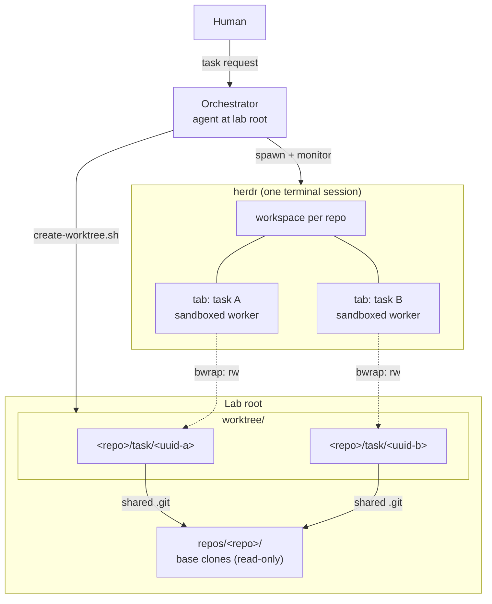

# Overview

## Goal

Enable safe, concurrent development across multiple repositories from a
single terminal, orchestrated through herdr.

- One task = one isolated `git worktree`; the base clone is never edited.
- A human talks to one **Orchestrator**; real work runs in separate
  **Worker** agent processes.
- Each worker operates inside the target repository, so that repo's own
  `AGENTS.md` and skills load — workers need no knowledge of this harness.
- Worker filesystem access is confined to its assigned worktree at the OS
  level.

## Non-Goal

- The orchestrator does **not** perform delegated work on other
  repositories in-process — it manages workspaces, workers, and status
  reporting. The single exception is development of the Worktreeharness
  repo itself, which the orchestrator does directly in a self-created
  worktree (see `worktreeharness-development`, ADR-0008).
- The orchestrator does **not** autonomously decompose the human's
  requirements and drive workers in a development loop — dispatch happens
  per explicit request.
- Workers are **not** injected with this project's `AGENTS.md` or
  project-level skills — the harness must not leak side effects into the
  worker's repo; only the target repo's own conventions apply.
- Not a general sandbox product: confinement exists to make delegation
  safe, not to run untrusted code.
- No worker→orchestrator reporting protocol — monitoring is pull-based
  via herdr.
- No support for SSH git remotes — this harness clones and pushes over
  HTTPS via `gh`.

## Requirements

- Multiple tasks, possibly in different repositories, run concurrently
  without branch/index collisions.
- Repository-specific conventions (`AGENTS.md`, `.agents/skills`) apply
  inside the worker's own repo.
- The human can observe and steer each worker through herdr (tabs, panes,
  prompts) from one terminal.
- A worker cannot modify anything outside its assigned worktree, while
  still being able to commit, push, and use its agent CLI.

## Background

Coding agents are typically run in one repo checkout at a time. Parallel
tasks on a shared checkout collide on branch state and uncommitted files;
separate clones waste setup and lose a shared base. Worktrees solve the
git side cheaply — but an agent that can edit anywhere still can't be
delegated to safely. Herdr already provides the UX for running many agent
processes (workspaces, tabs, panes); what's missing is the glue that binds
each agent to an isolated worktree with OS-level confinement.
Worktreeharness is that glue.

## High-level architecture



## Directory layout

```
<lab root>/
├── repos/<repo>/                    # Base clones — read-only, never edited
├── worktree/<repo>/<branch>/        # Active worktrees — all edits happen here
├── scripts/                         # Harness scripts + git hooks + lib/
├── .agents/                         # canonical skills + Antigravity config
├── .claude/                         # Claude Code config (skills → symlink)
├── .codex/                          # Codex hooks
├── .devin/                          # Devin CLI hooks
├── docs/design/                     # design docs (OKF v0.2)
├── docs/adr/                        # architecture decision records
└── tests/                           # shell test suites
```

Two topologies are supported: **split** (`<lab>/worktree/<repo>/<branch>`
checkouts under a shared lab root) and **unified** (the checkout is itself
the lab root). Every hook resolves `SCRIPT_ROOT` (the checkout — shared
libs, checkout `.env`) separately from the lab root (`repos/` + `worktree/`
ancestor — the policy boundary). See ADR-0007.

## Components

| Component | Responsibility | Doc |
|---|---|---|
| Orchestrator | Receives the human's request, dispatches workers, reports worker status on request. Implements only Worktreeharness itself, in a self-created worktree | [orchestration.md](orchestration.md) |
| Worker | Executes the task inside its assigned worktree; may use repo-local and global skills; cannot access outside its worktree | [orchestration.md](orchestration.md) |
| Worker sandbox | bubblewrap mount namespace confining a worker to its worktree | [sandbox.md](sandbox.md) |
| Guard hooks | Repo-local `PreToolUse` policies confining the orchestrator's own file/shell access | [guard-hooks.md](guard-hooks.md) |
| Agent configs | Per-CLI config dirs + canonical `.agents/skills` | [../reference/agent-configs.md](../reference/agent-configs.md) |
| Skills | Slash-command procedures available to the orchestrator | [../reference/skills.md](../reference/skills.md) |
| Harness scripts | `setup-repo`, `create-worktree`, `spawn-repo-agent` — import, isolation, dispatch | [../reference/scripts.md](../reference/scripts.md) |

## Security posture

- Orchestrator file access is confined by repo-local `PreToolUse` hooks —
  advisory, assuming a cooperating agent runtime.
- Workers are confined by a kernel mount namespace — enforcement, not
  advice. Details: [sandbox.md](sandbox.md).
- Dispatch is fail-closed: no `bwrap`, no sandboxed worker.

## Testing

```bash
bash tests/test-hooks.sh     # guard-hook allow/deny matrix
bash tests/test-sandbox.sh   # bwrap confinement
```

## References

- herdr — terminal workspace manager for agent processes
- bubblewrap — https://github.com/containers/bubblewrap
- git worktree — https://git-scm.com/docs/git-worktree
- Google Open Knowledge Format v0.2 — frontmatter convention used in `docs/`

## In this directory

| Doc | Contents |
|---|---|
| [orchestration.md](orchestration.md) | How to ask the orchestrator to run workers; lifecycle, monitoring, ownership, cleanup |
| [sandbox.md](sandbox.md) | Worker sandbox permission model — path × access × reason matrix, process isolation, known holes |
| [guard-hooks.md](guard-hooks.md) | Orchestrator-side `PreToolUse` policies — dual-root resolution, allowlist (built-in agent dirs + `ALLOWED_EXT_DIRS`), rm safety net |

Fact inventories (config tables, script/skill lists) live in
[../reference/](../reference/). Decision records live in
[../adr/](../adr/).

## Notes

Design docs describe *what* and *why*; implementation detail lives in the
code, which agents can read directly. Keep docs at the level of invariants
and intent — detailed specs rot faster than they help. All docs here use
OKF v0.2 frontmatter; each doc's `sources:` list declares the files it is
derived from and CI fails a PR that changes a source without the doc
(`scripts/check-docs-stale.sh`; see `CONTRIBUTING.md`).
