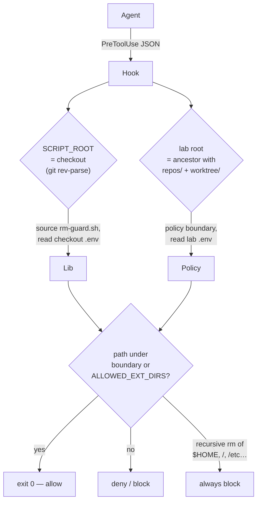

# Guard Hooks

## Goal

Confine the **orchestrator's** own file/shell access to the lab root —
advisory guardrails against accidents, in each agent's native hook format.
(Workers are confined by the sandbox instead — see [sandbox.md](sandbox.md).)

## Design

Three `PreToolUse` policies, implemented once per agent format:

| Hook | Effect |
|---|---|
| `guard-writes-to-worktree.sh` | Denies writes outside `worktree/` (unless allowlisted) |
| `restrict-to-repo-root.sh` | Denies reads/shell access outside the lab root unless allowlisted |
| `guard-bash-commands.sh` | Restricts command paths to the lab root or allowlist; dangerous recursive `rm` always blocked |

## Key decisions

- **Dual-root resolution** (ADR-0007): `SCRIPT_ROOT` (the checkout —
  shared libs, checkout `.env`) is resolved via
  `git rev-parse --show-toplevel`; the lab root (policy boundary) is the
  nearest ancestor containing `repos/` + `worktree/`. Works in both split
  and unified topologies.
- **`.env` union**: `ALLOWED_EXT_DIRS` is read from both roots and
  combined — one lab-root `.env` covers every checkout. External access
  exists only for listed paths; there is no global bypass.
- **Unconditional `rm` net**: recursive deletes of `$HOME`, `/`,
  `/home`, `/etc`, `/usr`, `/var`, … — including `sudo` and glob forms —
  are blocked regardless of the allowlist.

## Security

Hooks are **advisory**: they run inside the agent's tool-call pipeline and
assume a cooperating runtime. Obfuscated shell can evade path matching —
the bwrap sandbox is the enforcement layer for workers. Hooks exist to
stop orchestrator accidents, not attacks.

## Testing

`tests/test-hooks.sh` simulates each agent's stdin JSON protocol against
sandboxed labs (both topologies), asserting allow/deny, the
`ALLOWED_EXT_DIRS` union, and that each config's `command` actually
resolves and fires.
