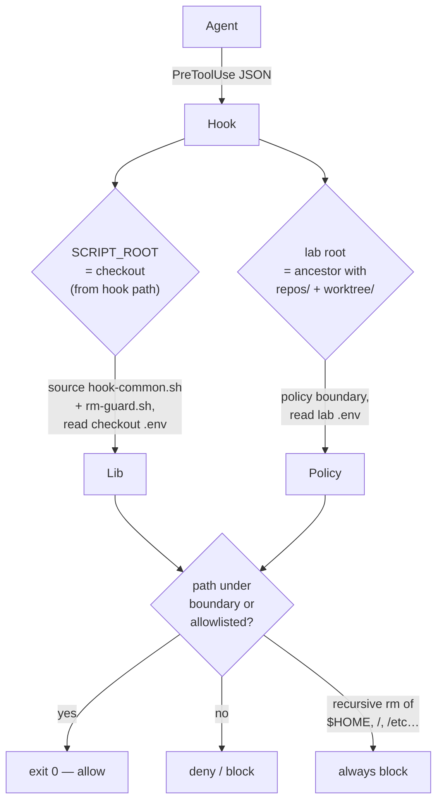

# Guard Hooks

## Goal

Confine the **orchestrator's** own file/shell access to the lab root —
advisory guardrails against accidents, in each agent's native hook format.
(Workers are confined by the sandbox instead — see [sandbox.md](sandbox.md).)

## Design

Three `PreToolUse` policies; each agent implements the subset its tool
surface needs — Codex ships only the command and write guards because it
has no file-path tool for `restrict-to-repo-root.sh` to guard (file
reads go through `shell`, writes through `apply_patch`). Each file under
`.<agent>/hooks/` is a thin adapter that names the agent kind and its
stdin JSON fields; the decision logic lives in
`scripts/lib/hook-common.sh` (which sources `rm-guard.sh`):

| Hook | Effect |
|---|---|
| `guard-writes-to-worktree.sh` | Denies writes outside `worktree/` (unless allowlisted) |
| `restrict-to-repo-root.sh` | Denies reads/shell access outside the lab root unless allowlisted |
| `guard-bash-commands.sh` | Restricts command paths to the lab root or allowlist — `~/` expands to `$HOME` as the shell would; dangerous recursive `rm` always blocked. Path candidates come from a word-level scan (`hook_lex_candidates`): quotes and escapes are honored, `$( )` / `${ }` / backtick interiors are scanned recursively, words containing regex/program metachars are expressions rather than paths, and globs are checked by their literal directory prefix |

## Key decisions

- **Dual-root resolution** (ADR-0007): `SCRIPT_ROOT` (the checkout —
  shared libs, checkout `.env`) is derived from the hook's own path —
  the configured `command` embeds `$(git rev-parse --show-toplevel)`, so
  `$0` is checkout-absolute; the lab root (policy boundary) is the
  nearest ancestor containing `repos/` + `worktree/`. Works in both split
  and unified topologies.
- **Allowlist**: `ALLOWED_EXT_DIRS` is read from both roots' `.env` and
  combined — one lab-root `.env` covers every checkout. No `.env` means
  no external access, exactly like an empty list — `.env.sample` is a
  copy-ready template (with `/tmp` plus the agents' config dirs as a
  suggested starting point), never read by the hooks. External access
  exists only for listed paths; there is no global bypass.
- **Unconditional `rm` net**: recursive deletes of `$HOME`, `/`,
  `/home`, `/etc`, `/usr`, `/var`, … — including `sudo` and glob forms —
  are blocked regardless of the allowlist.
- **Word-level command scanning** (ADR-0009): command text is lexed into
  shell words rather than split on a character sieve, so sed/awk program
  arguments no longer fragment into bogus `/` path candidates. Words
  carrying regex metachars (`^ , { } ( ) ! \`) are expressions and are
  skipped whole; `$( )`, `${ }` and backtick interiors are scanned
  recursively to preserve recall for real paths inside substitutions.

## Security

Hooks are **advisory**: they run inside the agent's tool-call pipeline and
assume a cooperating runtime. Obfuscated shell can evade path matching —
the bwrap sandbox is the enforcement layer for workers. Hooks exist to
stop orchestrator accidents, not attacks.

## Testing

`tests/test-hooks.sh` simulates each agent's stdin JSON protocol against
sandboxed labs (both topologies), asserting allow/deny, the built-in
agent dirs plus `ALLOWED_EXT_DIRS` union, and that each config's
`command` actually resolves and fires.
