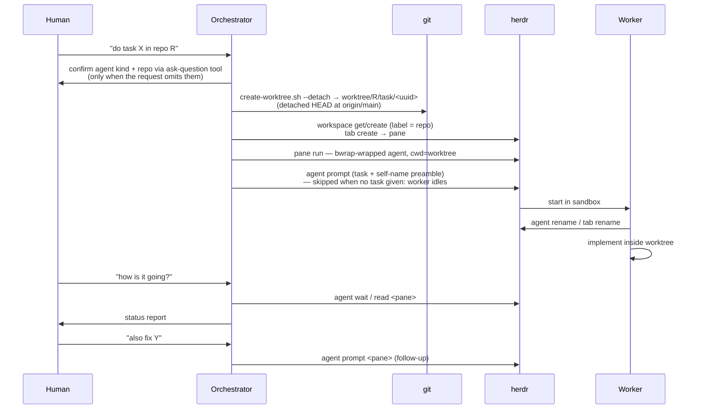

# Orchestration

## Goal

Let the human delegate work to a separate worker process that runs inside
the target repository — so the repo's own `AGENTS.md` and `.agents/skills`
load — while the orchestrator retains control through herdr.

## Design

Key decisions (see ADR-0003, ADR-0004):

- **Herdr-native model**: one workspace per repo (matched by label), one
  tab per task, the worker in the tab's root pane. No harness-side state
  to keep in sync.
- **Self-naming**: agents spawn as `w-<uuid>`; the prompt preamble asks
  the worker to rename itself and its tab once it understands the task.
  The worker knows nothing about the harness — the preamble is the whole
  contract.
- **Detached start**: task worktrees begin on a detached HEAD at
  `origin/main`; a branch is named only once the work — and its slug —
  is known (see ADR-0008).
- **Ask before dispatch**: when the request omits the agent kind or the
  repository, the orchestrator asks the user through its ask-question
  tool (`AskUserQuestion`/`ask_user_question`/`ask_question` — the name
  varies per agent) rather than defaulting silently (ADR-0008).
- **Dispatch is a single call**: `spawn-repo-agent.sh` is the only entry
  point and runs the whole sequence — worktree, tab, spawned agent,
  prompt. The orchestrator never runs `create-worktree.sh` for another
  repo and stops there: a worktree without a worker is a half-finished
  task. Missing inputs are collected *before* dispatch, not after.
- **The task is optional**: with no task text the worker spawns idle in
  its worktree — spawning alone is a valid use (pre-warmed standby,
  interactive steering). Work is sent later via
  `herdr agent prompt <pane> "<task>"`; the self-naming preamble only
  rides along when a task is submitted at spawn time.
- **Pull-based monitoring**: workers carry no reporting protocol;
  `herdr agent wait/read/prompt` is the interface.

## Responsibilities

- **Orchestrator**: workspace and worker lifecycle management, status
  checks on request. Does not perform the delegated work itself.
- **Worker**: executes the task in its worktree; may use repo-local and
  global skills; cannot access outside its worktree (enforced by the
  sandbox — see [sandbox.md](sandbox.md)).

## Steering a worker

The orchestrator is not the worker's owner — it is the spawner. Once a
worker is running, the human can always talk to it directly: focus the
herdr tab and type, or `herdr agent prompt <pane> "<instruction>"` from
any shell. Sandbox confinement applies regardless of who prompts.

Only caveat: avoid the human and the orchestrator prompting the same
worker concurrently — contexts interleave. In principle the side that
spawned the worker manages it, but human intervention is always allowed.

## Ownership and cleanup

A dispatched worktree belongs to its worker while follow-up work may be
routed there — the orchestrator never edits it directly. After the task is
done and the human approves, remove the worktree (and its branch, if the
worker created one) and close the tab.

## Security

Workers run inside the bubblewrap sandbox by default (fail-closed without
`bwrap`; `--no-sandbox` opts out). Sandboxed workers launch via
`herdr pane run` because `agent start --kind` cannot inject a wrapper.

## Testing

Covered indirectly by `tests/test-sandbox.sh` (spawn command construction)
and live-verified dispatch (self-naming, confined writes).

## Notes

There is no in-process fallback for other repositories: when herdr is
unavailable the orchestrator reports that and does not dispatch. (Work on
the Worktreeharness repo itself is the exception — see
`worktreeharness-development`.)
