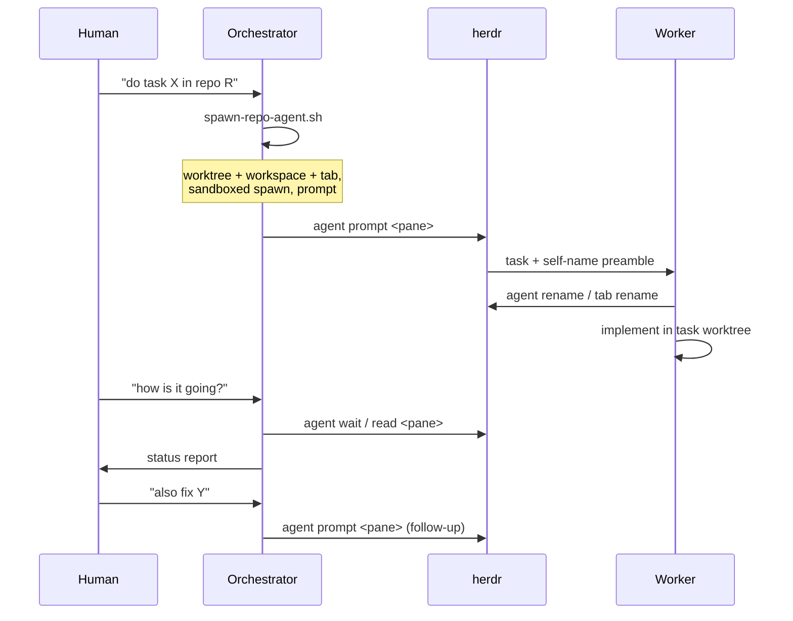

# Orchestration

## Use case



The human talks to one agent — the **Orchestrator** — running at the lab
root. To run work in another repo, ask the orchestrator in natural
language:

> "Dispatch a worker to `owner/SomeRepo` to add retry logic to the
> webhook handler."

The orchestrator invokes `/herdr-dispatch`, which calls
`scripts/spawn-repo-agent.sh owner/SomeRepo -- "add retry logic to the
webhook handler"`. One call performs the whole sequence: import/refresh
the base repo, create `worktree/SomeRepo/task/<uuid>` on `task/<uuid>`,
reuse or create the `SomeRepo` herdr workspace with a new tab, and launch
a sandboxed agent there with the task as its initial prompt.

Direct CLI usage (equivalent):

```bash
scripts/spawn-repo-agent.sh owner/SomeRepo -- "<task>"
scripts/spawn-repo-agent.sh --kind agy owner/SomeRepo -- "<task>"
scripts/spawn-repo-agent.sh --no-sandbox owner/SomeRepo -- "<task>"
```

## Worker lifecycle

1. **Spawn** — placeholder name `w-<uuid>`; cwd is the task worktree, so
   the target repo's own `AGENTS.md` and `.agents/skills` load. The worker
   knows nothing about Worktreeharness.
2. **Self-naming** — the initial prompt embeds a preamble asking the
   worker to rename itself (`herdr agent rename <pane> <slug>`) and its
   tab (`herdr tab rename <tab> <title>`) once it understands the task.
3. **Work** — commits happen inside the task worktree; the sandbox allows
   writing only to that worktree and the base repo's `.git`.
4. **Follow-ups** — `herdr agent prompt <pane> "<more work>"` sends
   additional tasks to the same agent in place.

## Monitoring (pull-based)

Workers carry no reporting protocol. The orchestrator checks on demand:

```bash
herdr agent wait <pane> --until idle   # block until the worker settles
herdr agent read <pane>                # inspect recent output
herdr agent prompt <pane> "<msg>"      # follow-up
```

## Ownership and cleanup

A dispatched worktree is owned by its worker for as long as follow-up work
may be routed to it. The orchestrator must not edit it directly; send
follow-ups through the worker instead. After the task is done and the
human approves, remove the worktree and branch:

```bash
git -C repos/<repo> worktree remove ../../worktree/<repo>/task/<uuid>
git -C repos/<repo> branch -d task/<uuid>
herdr tab close <tab>
```

## When to use which mode

| Mode | When |
|---|---|
| `/parallel-worktree` (in-process) | Quick edits, tasks that need the harness's own skills, or when herdr is unavailable |
| `/herdr-dispatch` (worker process) | Independent tasks, cross-repo work, long-running jobs, or anything that benefits from the target repo's own agent config loading |
