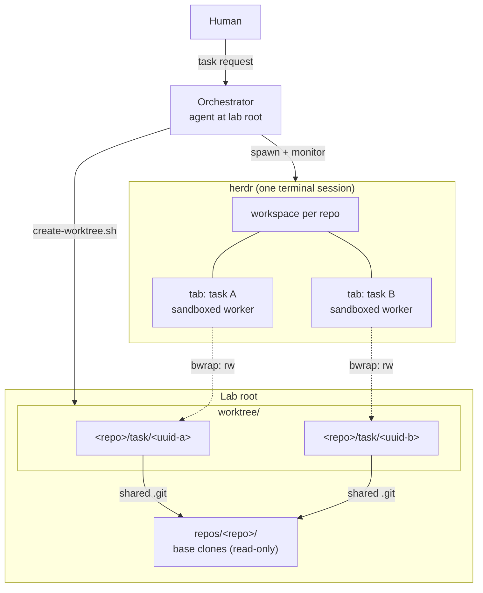
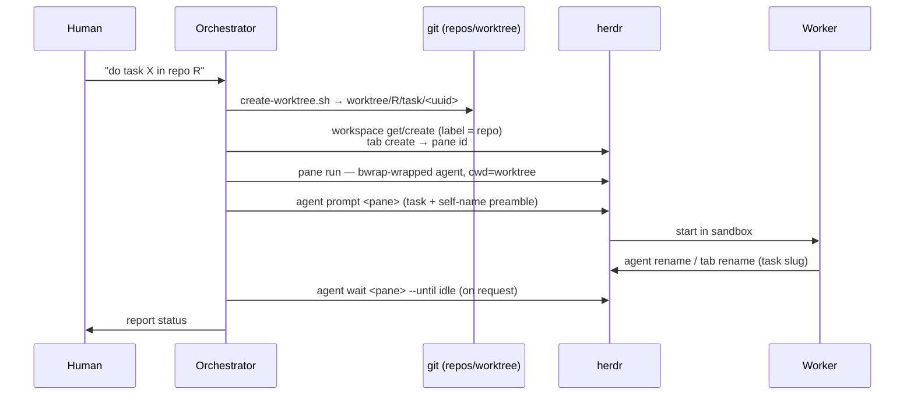
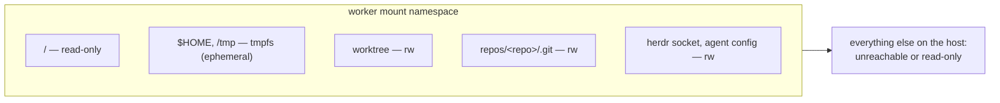

# Worktreeharness — Overview

Author: Devin

## Goal

Enable safe, concurrent development across multiple repositories from a
single terminal, orchestrated through herdr.

- One task = one isolated `git worktree`; the base clone is never edited.
- A human talks to one **Orchestrator**; real work runs in separate
  **Worker** agent processes.
- Each worker operates inside the target repository, so that repo's own
  `AGENTS.md` and skills load — workers need no knowledge of this harness.
- Worker filesystem access is confined to its assigned worktree at the OS
  level.

## Non-Goal

- The orchestrator does **not** perform the work itself — it manages
  workspaces, workers, and status reporting.
- Not a general sandbox product: confinement exists to make delegation
  safe, not to run untrusted code.
- No worker→orchestrator reporting protocol — monitoring is pull-based
  via herdr.
- No support for SSH git remotes — this harness clones and pushes over
  HTTPS via `gh`.

## Requirements

- Multiple tasks, possibly in different repositories, run concurrently
  without branch/index collisions.
- Repository-specific conventions (`AGENTS.md`, `.agents/skills`) apply
  inside the worker's own repo.
- The human can observe and steer each worker through herdr (tabs, panes,
  prompts) from one terminal.
- A worker cannot modify anything outside its assigned worktree, while
  still being able to commit, push, and use its agent CLI.

## Background

Coding agents are typically run in one repo checkout at a time. Parallel
tasks on a shared checkout collide on branch state and uncommitted files;
separate clones waste setup and lose a shared base. Worktrees solve the
git side cheaply — but an agent that can edit anywhere still can't be
delegated to safely. Herdr already provides the UX for running many agent
processes (workspaces, tabs, panes); what's missing is the glue that binds
each agent to an isolated worktree with OS-level confinement.
Worktreeharness is that glue.

## High-level architecture



## Components

| Component | Responsibility | Doc |
|---|---|---|
| Orchestrator | Receives the human's request, dispatches workers, reports worker status on request. Does no implementation work itself | [orchestration.md](orchestration.md) |
| Worker | Executes the task inside its assigned worktree; may use repo-local and global skills; cannot access outside its worktree | [orchestration.md](orchestration.md) |
| Harness scripts | `setup-repo`, `create-worktree`, `spawn-repo-agent` — the mechanics of import, isolation, dispatch | [scripts.md](scripts.md) |
| Guard hooks | Repo-local `PreToolUse` policies confining the orchestrator's own file/shell access | [agent-integrations.md](agent-integrations.md) |
| Worker sandbox | bubblewrap mount namespace confining a worker to its worktree | [sandbox.md](sandbox.md) |
| Skills | Slash-command procedures available to the orchestrator | [skills.md](skills.md) |

## Key flows

### Dispatch



### Confinement



## Security

- Orchestrator file access is confined by repo-local `PreToolUse` hooks
  (advisory — they assume a cooperating agent runtime).
- Workers are confined by a kernel mount namespace: `/` read-only,
  `$HOME`/`/tmp` ephemeral, only the worktree and the base repo's `.git`
  writable. Credentials outside the agent's own config stay hidden; no
  ssh material is bound.
- Sandbox construction is fail-closed: no `bwrap`, no dispatch.

## Known issues

- A worker can touch other refs of its repo through the writable base
  `.git` — the smallest hole that keeps `git commit` working.
- Network is shared; confinement is filesystem + process only.
- Hooks remain advisory and evadable — the sandbox is the enforcement
  layer for workers; hooks protect against orchestrator accidents.

## Testing

```bash
bash tests/test-hooks.sh     # guard-hook allow/deny matrix
bash tests/test-sandbox.sh   # bwrap confinement
```

## Operations

- Dispatch: `scripts/spawn-repo-agent.sh <repo> -- "<task>"`
- Monitor: `herdr agent wait/read/prompt <pane>`
- Cleanup: remove task worktree + branch, close the herdr tab

## References

- herdr CLI — terminal workspace manager for agent processes
- bubblewrap — https://github.com/containers/bubblewrap
- git worktree — https://git-scm.com/docs/git-worktree
- Google Open Knowledge Format v0.2 — doc frontmatter convention used in `docs/`

## Notes

Design docs describe *what* and *why*; implementation detail lives in the
code, which agents can read directly. Keep docs at the level of invariants
and intent — detailed specs rot faster than they help.
