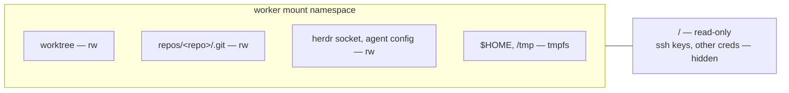

# Worker Sandbox

## Goal

Confine a dispatched worker to its assigned worktree at the OS level —
agent-agnostic, covering every subprocess, independent of whether the
target repo ships hooks.

## Design

`scripts/lib/sandbox-wrap.sh` builds a **bubblewrap mount namespace**
around the agent command: a kernel-enforced boundary, not an advisory
check. Unlike repo-local hooks it cannot be bypassed by obfuscated shell.

## Filesystem permissions

| Path | Access | Why |
|---|---|---|
| `/` | read-only | Whole system visible but unwritable |
| `/tmp` | tmpfs (ephemeral) | Host `/tmp` is hidden; scratch writes vanish on exit. If the worktree itself lives under `/tmp`, `/tmp` is bound rw instead so the worktree bind isn't orphaned |
| `$HOME` | tmpfs (ephemeral) | Hides `~/.ssh` keys, other repos, credentials; writes vanish on exit |
| `worktree/<repo>/task/<uuid>` | read/write | The only project path the worker may modify |
| `repos/<repo>/.git` (git-common-dir) | read/write | Linked worktrees store index/objects/refs here — required for `git add`/`commit` |
| `~/.config/herdr` | read/write | Herdr socket + config — needed for `herdr agent rename`/`tab rename` |
| `~/.config/gh` | read/write | `gh` auth token and CLI state for pushes/PRs |
| `~/.gitconfig`, `~/.git-credentials`, `~/.netrc` | read-only | Git identity and HTTPS credentials; usable but not modifiable |
| `~/.ssh`, `$SSH_AUTH_SOCK` | **not bound at all** | This harness clones/pushes over https via `gh` — no ssh in the sandbox, private keys and the agent socket stay hidden |
| Agent binary under `$HOME` (e.g. `~/.local/bin/devin`, `~/.local/bin/herdr`) | bound at PATH location | Rebound so the tmpfs'd `$HOME` doesn't hide the CLI; `herdr` is always rebound for self-rename |
| Agent config dir (per `--kind`) | read/write | The CLI's own session/auth state: `~/.claude`+`~/.claude.json`, `~/.config/devin`+`~/.local/share/devin`+`~/.devin`, `~/.gemini`, `~/.codex` |

## Process isolation

PID, UTS, and IPC namespaces are unshared; the sandbox dies with its
parent. **Network is shared** — agents need API and git access — so
confinement is filesystem + process only.

## Failure mode

Dispatch is **fail-closed**: if `bwrap` is not on PATH, the spawn aborts
rather than silently running unconfined. `--no-sandbox` opts out
explicitly.

## Known holes

- `repos/<repo>/.git` is writable — a worker could touch other refs of the
  same repo. Far narrower than arbitrary filesystem write, but not zero.
- A repo whose remote uses an SSH URL (`git@github.com:...`) cannot push
  from inside the sandbox — this harness only supports https remotes via
  `gh`.
- Any binary the worker can reach may be executed; the sandbox restricts
  *where it can write*, not what it runs.

## Verification

`tests/test-sandbox.sh` covers command construction and real confinement
(28 checks). Live-verified: a sandboxed Devin worker self-renamed via
herdr, committed to its worktree, and writes to `/tmp` and `~/.config`
never reached the host.
