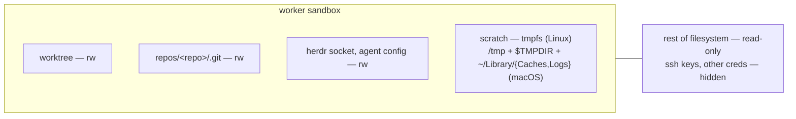

# Worker Sandbox

## Goal

Confine a dispatched worker to its assigned worktree at the OS level —
agent-agnostic, covering every subprocess, independent of whether the
target repo ships hooks.

## Design

`scripts/lib/sandbox-wrap.sh` builds an **OS-enforced boundary** around
the agent command — not an advisory check, and not bypassable by
obfuscated shell. The backend is selected by platform:

- **Linux — bubblewrap mount namespace**: `/` is bound read-only, `$HOME`
  and `/tmp` become tmpfs, and only the listed paths stay writable.
- **macOS — Seatbelt (`sandbox-exec`)**: the profile is
  `allow default` + `deny file-write*` + `allow file-write* <allowed
  subpaths>`, then read-deny rules for credentials and sibling lab trees.
  Seatbelt is last-match-wins, so write allows land after the global
  write-deny and read denies land last. `allow default` (rather than
  `deny default`) keeps the profile robust: an exhaustive op allowlist —
  mach services, sysctl, iokit — is fragile across macOS releases and a
  missing op breaks agents silently, while the property the harness
  promises is write confinement plus credential hiding. The profile is
  written to a temp file under `$TMPDIR` and applied with
  `sandbox-exec -f`: `herdr pane run` types the launch line before the
  pane's shell reads input, where the tty caps a line at 1024 bytes, and an
  inline profile (about 2 KB) would be truncated.

```mermaid
flowchart LR
    subgraph NS["worker sandbox"]
        WT["worktree — rw"]
        GIT["repos/&lt;repo&gt;/.git — rw"]
        CFG["herdr socket, agent config — rw"]
        TMP["scratch — tmpfs (Linux)<br/>/tmp + $TMPDIR + ~/Library/{Caches,Logs} (macOS)"]
    end
    SYS["rest of filesystem — read-only<br/>ssh keys, other creds — hidden"]
    NS --- SYS
```

## Filesystem permissions

| Path | Access | Why |
|---|---|---|
| `/` | read-only | Whole system visible but unwritable |
| Scratch | ephemeral on Linux (tmpfs `/tmp` + `$HOME`), host dirs on macOS (`/tmp`, `$TMPDIR` tree, `~/Library/{Caches,Logs}`, `~/.cache`) | Agents need somewhere to write; Linux hides it, macOS has no tmpfs equivalent so real scratch dirs are granted instead. If the worktree itself lives under `/tmp`, Linux binds `/tmp` rw so the worktree bind isn't orphaned |
| `$HOME` | Linux: tmpfs (all contents hidden) · macOS: reads allowed, writes denied except the granted dirs | Hides/protects `~/.ssh` keys, other repos, credentials |
| `worktree/<repo>/task/<uuid>` | read/write | The only project path the worker may modify |
| `repos/<repo>/.git` (git-common-dir) | read/write | Linked worktrees store index/objects/refs here — required for `git add`/`commit` |
| `~/.config/herdr` | read/write | Herdr socket + config — needed for `herdr agent rename`/`tab rename` |
| `~/.config/gh` | read/write | `gh` auth token and CLI state for pushes/PRs |
| `~/.gitconfig`, `~/.git-credentials`, `~/.netrc` | read-only | Git identity and HTTPS credentials; usable but not modifiable (macOS gets this for free: read-allowed, not in the write allowlist) |
| `~/.ssh`, `$SSH_AUTH_SOCK` | hidden | This harness clones/pushes over https via `gh` — private keys and the agent socket stay out of reach. Linux: never bound. macOS: `file-read*` denied on the credential dirs plus a `literal` deny on the socket path |
| Other lab trees (`repos/*`, `worktree/*` siblings) | hidden on macOS (`require-all`/`require-not` read denies carve out only the worker's own worktree + base `.git`); on Linux hidden whenever the lab lives under the tmpfs'd `$HOME` | A worker has no business in other tasks' checkouts |
| Agent binary under `$HOME` (e.g. `~/.local/bin/devin`, `~/.local/bin/herdr`) | Linux only: bound at PATH location | Rebound so the tmpfs'd `$HOME` doesn't hide the CLI; `herdr` is always rebound for self-rename. macOS needs no rebind — reads are allowed |
| Agent config dir (per `--kind`) | read/write | The CLI's own session/auth state: `~/.claude`+`~/.claude.json`, `~/.config/devin`+`~/.local/share/devin`+`~/.devin`, `~/.gemini`, `~/.codex` |

## Process isolation

Linux unshares the PID, UTS, and IPC namespaces; the sandbox dies with its
parent. macOS/Seatbelt has no namespace equivalent — isolation there is
filesystem-only. **Network is shared on both** — agents need API and git
access.

## Failure mode

Dispatch is **fail-closed**: if the platform's backend (`bwrap` on Linux,
`sandbox-exec` on macOS) is missing, the spawn aborts rather than silently
running unconfined. `--no-sandbox` opts out explicitly.

## Known holes

- `repos/<repo>/.git` is writable — a worker could touch other refs of the
  same repo. Far narrower than arbitrary filesystem write, but not zero.
- A repo whose remote uses an SSH URL (`git@github.com:...`) cannot push
  from inside the sandbox — this harness only supports https remotes via
  `gh`.
- Any binary the worker can reach may be executed; the sandbox restricts
  *where it can write*, not what it runs.
- `sandbox-exec` is deprecated by Apple (since 10.8) but remains the only
  mechanism for applying Seatbelt to arbitrary CLI processes; it is used
  in production by Bazel, Homebrew, Claude Code, and Codex. If Apple
  removes it, macOS dispatch becomes `--no-sandbox` only.
- macOS confinement is weaker than Linux: no process isolation, host
  scratch dirs stay writable (nothing is ephemeral), and only enumerated
  credential paths are read-denied rather than all of `$HOME`.
- Seatbelt's SSH-agent-socket deny covers the socket path literally;
  exotic agents reachable via other mechanisms are out of scope.

## Verification

`tests/test-sandbox.sh` covers command construction and real confinement
on both backends, and CI runs it on ubuntu and macos runners.
Live-verified on Linux: a sandboxed Devin worker self-renamed via
herdr, committed to its worktree, and writes to `/tmp` and `~/.config`
never reached the host.
